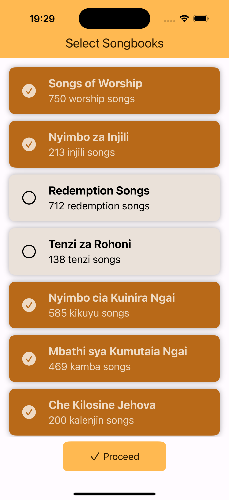
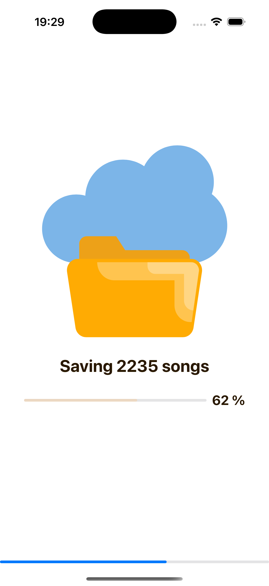
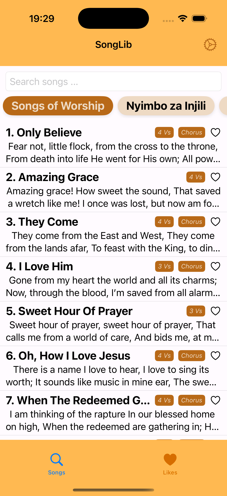
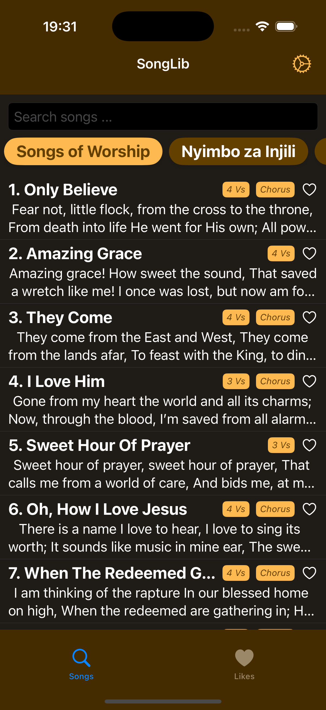

# 🎵 SongLib

**SongLib** is a modern, cross-platform church hymn library and songbook manager.
With **10+ songbooks**, **10000+ songs** and powerful search, it lets you keep all your favorite hymns right at your fingertips — even offline.

Built with **SwiftUI**, **Core Data**, and backed by **MongoDb**, the app offers an intuitive and fast experience even without an internet connection.

> 🔗 Android Version Repo: [@SiroDaves/SongLib-Android](https://github.com/SiroDaves/SongLib-Android)

<a href="https://apps.apple.com/us/app/id6446771305">
  
</a>

## ✨ Features

* 📖 **14 Songbooks Included** – Choose from a wide selection of hymnals.
* 📚 **Custom Collections** – Create your own set of favorite church hymns.
* 🔍 **Real-Time Search** – Search by song **title**, **number**, or **lyrics** instantly.
* 📜 **Verse Navigation** – Swipe up/down to slide through song verses seamlessly.
* 🌐 **Cross-Platform** – Runs on **Android**, **iOS**, **Windows**, **Linux**, and **macOS**.
* 📶 **Offline Mode** – Once set up, the app works without internet access.
* ☁ **Cloud-Backed** – Uses a **MongoDB** database with backend services for sync and updates.

Backend API: [`https://songlive.vercel.app/api`](https://songlive.vercel.app/api)

## 📸 Screenshots

<table>
    <tr>
        <td></td>
        <td></td>
        <td></td>
        <td></td>
        <td></td>
        <td></td>
    </tr>
</table>

## 🛠 Tech Stack

### **Frontend**

* **Swift UI** Declarative iOS UI framework
* **[Lottie](https://github.com/airbnb/lottie-ios)** + Animation rendering
* **[Swinject](https://github.com/Swinject/Swinject)** Dependency Injection
* **Core Data** Local persistence for offline use

### **Backend**

* **Node.js** + **MongoDB**
* REST API hosted on **Vercel**

## 🚀 Getting Started

### 1. Clone the Repository

```bash
git clone https://github.com/SiroDaves/SongLib-iOS.git
cd SongLib-iOS
```

### 2. Open in Xcode

```bash
open SongLib.xcodeproj
```

Or open `SongLib.xcworkspace` if you're using CocoaPods or other workspace-based dependency managers.

### 4. Install Dependencies

Ensure you have [CocoaPods](https://cocoapods.org/) or use Swift Package Manager. If using CocoaPods:

```bash
pod install
```

Or if using Swift Package Manager, just build the project in Xcode and it will fetch the packages.

### 5. Build and Run

Select the correct simulator or your iOS device in Xcode, then hit:

```
Cmd + R
```

## 💡 Notes

* The app uses Core Data to cache and persist content for offline usage.
* Supabase is used for syncing and querying the latest content.
* For development and testing, you can mock network calls or pre-load your Core Data store.

## 📄 License

This project is licensed under the MIT License.
